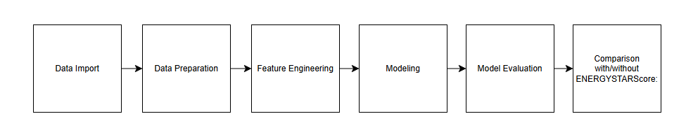
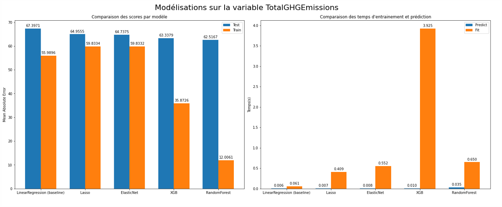
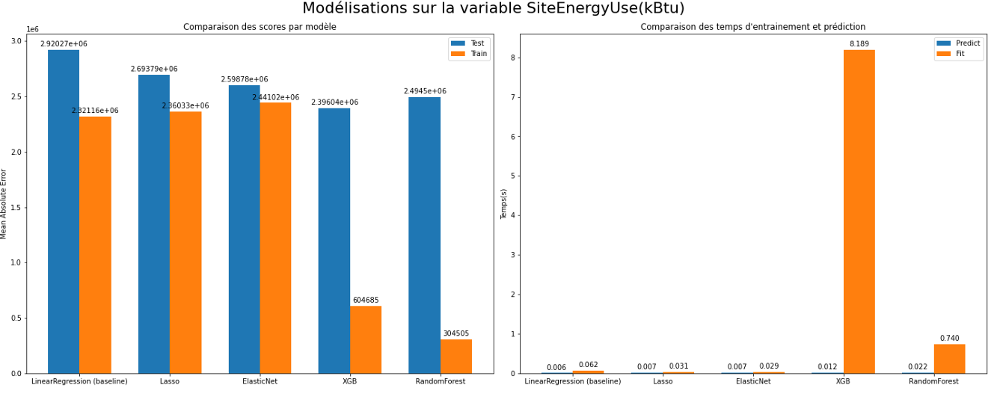

# Seattle building energy and CO₂ forecast

 <!-- Image d'introduction -->

## 🏢**Project Overview**

This project aims to predict the **energy consumption** (`SiteEnergyUse(kBtu)`) and **CO₂ emissions** (`TotalGHGEmissions`) of non-residential buildings in Seattle using data from 2015 and 2016. 
By forecasting these metrics, companies can identify opportunities to reduce **energy costs** and **enhance the sustainability** of their operations.

In alignment with Seattle's goal of achieving carbon neutrality by 2050, these predictions provide a means to optimize energy performance while minimizing data collection costs.
Specifically, we investigate if omitting certain costly metrics like `ENERGYSTARScore` could still yield accurate predictions.

## 🎯**Objectives**

- **Primary Goal**: Predict energy consumption and CO₂ emissions to support energy management and sustainability efforts.
- **Secondary Goal**: Assess the necessity of the ENERGYSTARScore in predictions, exploring if we can exclude it to reduce data collection costs without compromising model accuracy.

## 📊**Data Sources**
- **Main Dataset**: [Seattle Energy Benchmarking Data (2015-2016)](https://www.seattle.gov/environment/climate-change/buildings-and-energy/energy-benchmarking/data-and-reports)
- **Dataset Description**: [Seattle Energy Benchmarking Data Description](https://data.seattle.gov/Built-Environment/2016-Building-Energy-Benchmarking/2bpz-gwpy/about_data)

## **Project Structure**
This project is divided into two main notebooks:

1. **Data Preparation and Exploration**: Cleaning, feature engineering, and exploratory data analysis (EDA) of the dataset.
2. **Modeling and Evaluation**: Implementation and evaluation of various prediction models to find the best approach for our targets. We also compare model performance with and without ENERGYSTARScore.

## 🔬 Methodology

 <!-- Diagramme de flux -->

1. **Data Import**
   - Load necessary libraries, set configurations, load the data and inspect initial characteristics.

2. **Data Preparation and Exploration**
   - **Data Cleaning**: Handle missing values, inconsistencies, and outliers in the dataset.
   - **Exploratory Data Analysis (EDA)**:
      - **Categorical Variables**: Analyze categorical data and correct typos where necessary.
      - **Numerical Variables**: Understand distributions of continuous variables.
      - **Correlations**: Examine relationships between features and with target variables.
      - **Target Variables Analysis**: Explore characteristics of `TotalGHGEmissions` and `SiteEnergyUse(kBtu)`.

3. **Feature Engineering**
   - Create new variables, encode categories, and normalize data to enhance model performance.

4. **Modeling**

   - **Model Selection**: Testing various models for predictions.
     - **Linear Regression**: A basic linear model.
     - **Lasso and Elastic Net**: Adds regularization to improve generalization.
     - **Random Forest and XGBoost**: Captures non-linear relationships.
       
5. **Model Evaluation**

   - **Selection of Best Models**: Identifying top-performing models based on evaluation metrics.
   - **Making Predictions**: Generating and analyzing predictions from selected models.
     - **CO₂ Emissions Prediction**: Analyzing predictions for `TotalGHGEmissions`.
     - **Energy Consumption Prediction**: Evaluating predictions for `SiteEnergyUse(kBtu)`.

6. **ENERGYSTARScore Evaluation**
   - **Comparison with/without ENERGYSTARScore**: Analyze the impact of excluding the `ENERGYSTARScore` variable on model accuracy to determine if it can be safely omitted, reducing data collection costs.

## ✅**Results**

### Best Model
- **Random Forest** provided a good balance between prediction accuracy and computational efficiency.

#### CO₂ Emissions (`TotalGHGEmissions`)

   - The graph illustrates the **Mean Absolute Error (MAE)** on both train and test sets across different models, as well as the training and prediction times for each model.
   - Note: In the bar charts, 'Train' (orange) represents the model’s average performance on the training data during each cross-validation fold, while 'Test' (blue) shows the performance on the validation subsets within cross-validation. This 'Test' does not refer to the final test set but to internal validation. The final MAE on the test set is calculated separately, which may cause slight differences due to evaluating unseen data as a single set, rather than as averaged folds.
   - Random Forest achieved a balance between accuracy and computational efficiency, making it the best choice for predicting emissions.

#### Energy Consumption (`SiteEnergyUse(kBtu)`)

   - This graph shows the **MAE** on train and test sets for each model, as well as the computational times.
   - Similar to the emissions prediction, Random Forest demonstrated high accuracy with reasonable computational demands.

### ENERGYSTARScore Assessment
- Results suggest that excluding `ENERGYSTARScore` had a minimal impact on prediction accuracy, implying it could be safely omitted, thus reducing data collection costs.

  - **With `ENERGYSTARScore`**:
      - **CO₂ Emissions**: MAE = 68.47, R² = 0.47
      - **Energy Consumption**: MAE ≈ 2.55 million, R² = 0.69
  
  - **Without `ENERGYSTARScore`**:
      - **CO₂ Emissions**: MAE = 70.25, R² = 0.44
      - **Energy Consumption**: MAE ≈ 2.67 million, R² = 0.66

### Observations
- The model performs better in predicting energy consumption than CO₂ emissions. This may be because energy consumption is directly related to measurable factors (e.g., building size, usage type, and energy sources) that are relatively stable and straightforward to quantify. In contrast, CO₂ emissions can be influenced by additional, complex factors such as the efficiency of energy systems, external climate conditions, and variations in operational practices, which introduce more variability and make predictions more challenging.

- **Conclusion**: Removing `ENERGYSTARScore` resulted in a minor decrease in performance (approx. 2-3% in R²), suggesting it contributes some predictive value but may not be essential. Thus, omitting it could be a viable option if data collection costs are a concern.

## 🚀**Potential Improvements**

- **Advanced Feature Engineering**: Further transformations and interactions among variables could potentially improve model accuracy.
- **Optimized Hyperparameter Tuning**: Using techniques like Bayesian Optimization could streamline tuning for complex models such as XGBoost.

## 📫 Contact
[Alexis MARCEAU] - [alexis.marceau.12@gmail.com][https://www.linkedin.com/in/alexis-marceau/?locale=en_US]
